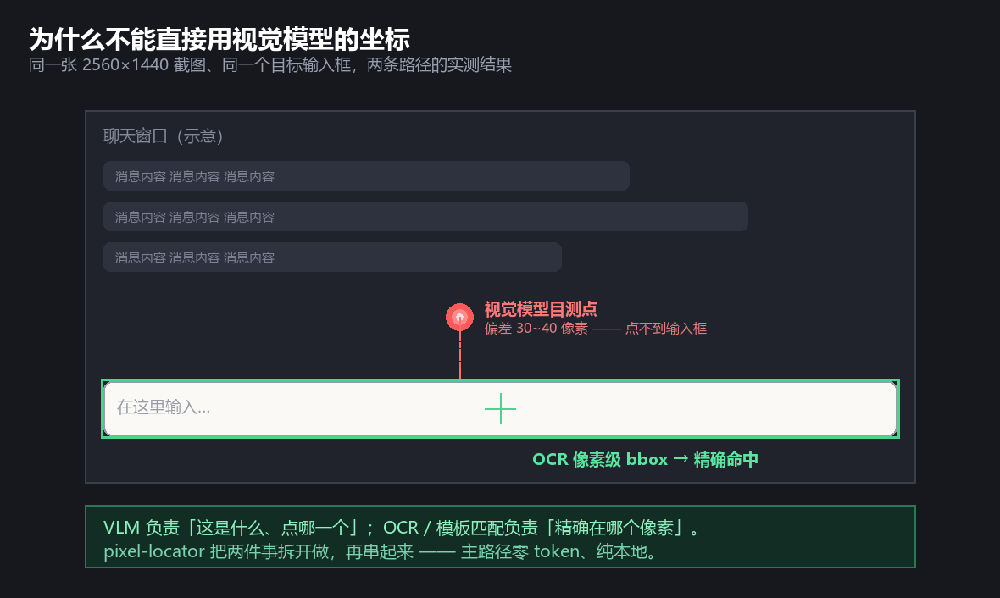
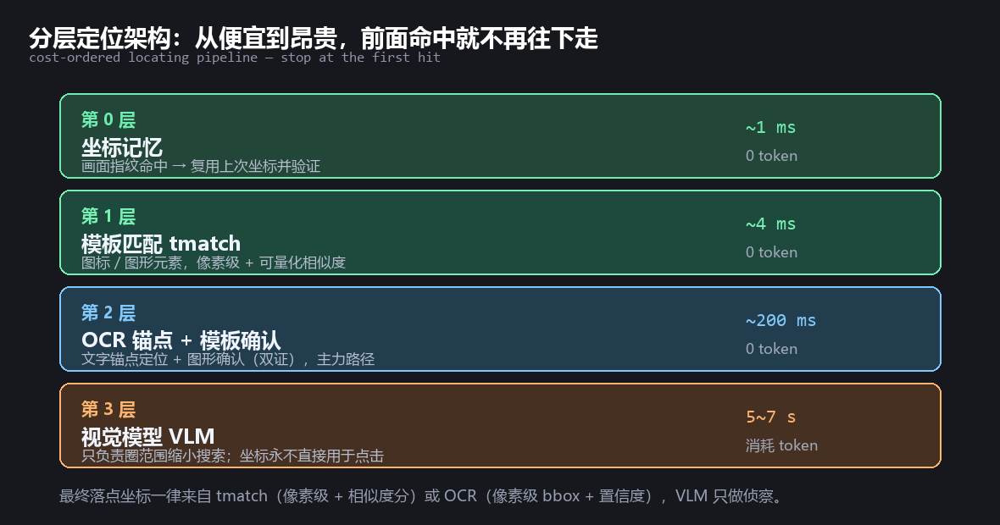
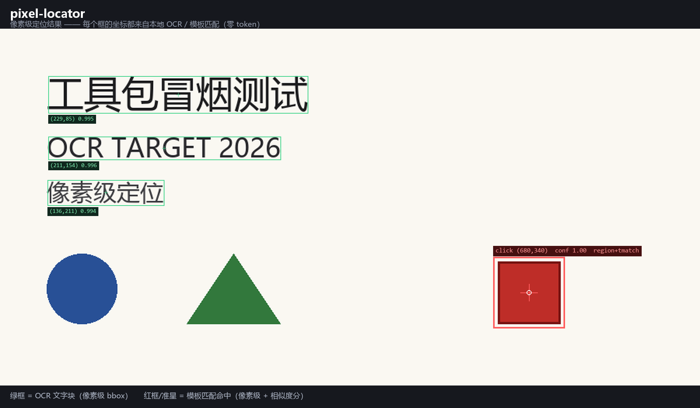

# pixel-locator

[](https://github.com/lyjlcbhtq/pixel-locator/actions/workflows/smoke.yml)


> **Pixel-precise click coordinates for AI agents.**
> Vision models miss by 30–40 pixels; OCR and template matching land on the exact pixel.
> Pure CPU · No GPU · No cloud API · No token cost · Works **without any vision model**.

---

## The problem

Almost every "AI operates your computer" stack does the same thing:
screenshot → send to a vision-language model → the model returns coordinates → click.

There is a widely underestimated flaw in that pipeline: **VLM coordinates are not accurate.**

Measured on a 2560×1440 display, targeting a text input box:

| Method | Coordinates returned | Outcome |
|---|---|---|
| Vision model's own estimate | (1125, 1154) | landed in the message area **above** the input — **failed** |
| OCR pixel-level bbox | (802, 1196) | **exact hit** |

The error was ~**30–40 logical pixels** — larger than the height of the input box itself.



This is not a matter of model intelligence; it is structural. Mainstream multimodal models
compress the input image onto a coarse patch grid (e.g. 14px patches, 3:1 downsampling,
a few hundred tokens per image). By the time a 1280×900 screenshot reaches the model,
its effective resolution is far too low to produce **pixel-level coordinates**.

**Hence the core idea of this project:**

> Let the model do what it is good at (understanding what is on screen and which element to target),
> let local algorithms do what they are good at (finding exactly which pixel that element occupies).
> Do the two separately, do each one well, then chain them.

---

## The six tools

| Tool | What it does |
|---|---|
| **`vlocate`** | **Hybrid locator (flagship)**: template/anchor first, VLM only as a last resort. Returns a **pixel-precise click point with a confidence grade** (`high` / `medium` / `low`). |
| **`findtext`** | **OCR text locator**: give it a word, get its **pixel bbox** on screen. Ships with an md5 content cache and an optional daemon (**~35× faster**). |
| **`tmatch`** | **Template matching**: locate **non-text elements** (icons, graphics, image buttons) with a pixel box and a **similarity score**. Zero GPU; auto-accelerates on CUDA, auto-falls back to CPU. |
| **`guibot`** | **Declarative GUI flows**: write locate → click → type → assert steps as JSON and replay them. |
| **`winctl`** | **Window control**: list / raise / move windows, and **capture a window in the background without stealing focus**. |
| **`headless_check`** | **Headless acceptance**: render → screenshot → verify on-screen text via OCR, and **prove the foreground window never changed**. |

All six share the same conventions: JSON output, uniform exit codes
(`0` = success, `1` = no result / warning, `2` = usage error), and coordinates in
**physical screen pixels**.

---

## Locating paths and measured speed



`vlocate` tries these paths from cheapest to most expensive, and stops at the first hit:

| Path | Command | Confidence | Measured | API tokens |
|---|---|---|---|---|
| **Region + template** | `--region x0,y0,x1,y1 --template icon.png` | **high** | **4 ms** | 0 |
| **Anchor + template** | `--anchor "Settings" --template gear.png` | **high** | 23 ms match + 2.2 s OCR | 0 |
| Anchor + geometric offset | `--anchor "Password" --offset 1,0` | medium | ~2.2 s | 0 |
| Candidate list | `--list-all` | — | ~2.2 s | 0 |
| VLM fallback | `--target "the red submit button"` | low | 5–7 s | **yes** |

**A VLM's output is never used directly as a click coordinate** — it only narrows the search
from the whole screen down to a small region.

### Component benchmarks (2560×1440, pure CPU)

| Mode | Time | vs. baseline |
|---|---|---|
| Cold process, forced real OCR (`--no-cache`) | 7082 ms | 1× |
| Cold process, content-cache hit | ~600 ms | 12× |
| **Daemon (engine resident) + cache hit** | **175–225 ms** | **~35×** |
| Engine loaded, full-screen inference | 2280 ms | 3× |
| 800×600 region inference | 1280 ms | 5.5× |
| **tmatch window match (OCR bypassed)** | **4 ms** | **~1770×** |
| **vlocate region+template, end to end** | **4 ms** | — |

**Three hard conclusions:**

1. **OCR has a ~1.2 s physical floor.** Even an 800×600 region containing only 5 text blocks
   takes 1280 ms. That is fixed model-forward cost — no amount of parameter tuning reaches milliseconds.
2. **The single biggest win is the daemon** (`findtext.py --serve`): it zeroes out process start,
   imports, engine init and warm-up — 7 s → 0.6 s.
3. **Millisecond-level speed requires bypassing OCR entirely.** The steady-state path is
   coordinate memory (1 ms) + tmatch verification (4 ms). So the right design is to make
   **OCR appear only once**, and let its result settle into templates and memory.



*Generated by `python docs/make_demo.py` — every coordinate in this image comes from the tools' real output.*

---

## Quick start

```bash
git clone https://github.com/<your-name>/pixel-locator.git
cd pixel-locator
pip install -r requirements.txt

# 1. Environment self-check (everything should be ok)
python toolkit.py doctor

# 2. Smoke test (9/9 expected)
python smoke.py

# 3. OCR text location: get pixel-level coordinates
python toolkit.py findtext --image fixtures/sample.png --query "像素级定位"

# 4. Template matching: locate a non-text element
python toolkit.py tmatch find fixtures/template.png fixtures/sample.png

# 5. Hybrid location (recommended): anchor + template, two-way confirmation
python toolkit.py vlocate --image fixtures/sample.png \
    --anchor "工具包冒烟测试" --template fixtures/template.png --window 1200

# 6. No idea what it is called? List candidates and let the calling AI choose
python toolkit.py vlocate --image fixtures/sample.png --list-all
```

**Want to run something right away:**

```bash
python examples/01_locate_text.py     # OCR locate: get pixel-level coordinates
python examples/02_hybrid_locate.py   # anchor + template, two-way confirmation (recommended)
python examples/03_python_api.py      # in-process API: list on-screen text with coordinates
python tools/guibot.py examples/04_flow.json --check   # validate a declarative flow

python benchmarks/bench_ocr.py        # reproduce the OCR speed numbers
python benchmarks/bench_tmatch.py     # reproduce "fullscreen vs anchor window"
```

`paths.json` is optional — **everything runs without it**
(it falls back to `paths.example.json`). Copy it only if you need to customize.

---

## Typical usage

**A. Click a button that has text (no model needed)**

```bash
python tools/vlocate.py --text "Send" --click
```

**B. Click an icon (no text — use a template)**

```bash
python tools/tmatch.py collect --from screenshot.png --region 640,300,726,386 --name gear
python tools/vlocate.py --anchor "Settings" --template templates/gear.png --click
```

**C. Turn a sequence of actions into a reusable flow**

```json
{
  "steps": [
    {"action": "find", "text": "Username", "save_as": "u"},
    {"action": "type",  "text": "alice"},
    {"action": "find",  "text": "Password"},
    {"action": "type",  "text": "s3cret"},
    {"action": "find",  "text": "Sign in", "click": true},
    {"action": "assert_text", "text": "Welcome"}
  ]
}
```

```bash
python tools/guibot.py flow.json --dry    # dry run first — clicks nothing
python tools/guibot.py flow.json          # for real
```

**D. Unattended acceptance check of a page (without stealing focus)**

```bash
python tools/headless_check.py page.html --out shot.png --expect "Submitted"
```

---

## Common pitfalls (read before using)

These are **real traps we hit**, not hypothetical warnings.

### 1. Coordinates are **physical pixels**, not logical pixels
- Every tool outputs physical screen pixels (identical to logical at 100% DPI)
- At 150% DPI: **logical = physical / 1.5**
- If clicks are always off by a constant ratio, check your DPI scaling first
- **Real incident**: a physical coordinate was divided by a screenshot scale factor again —
  the click landed somewhere else entirely

### 2. **Never click a VLM's raw coordinates**
- VLM error can reach tens of pixels — enough to miss an input box or a small button
- **Real incident**: the region a VLM reported, `[63,69,405,151]`, did not even contain the
  target (ground truth `y=51–117`; it missed 18 px off the top)
- Correct usage: VLM narrows the search area only; the final coordinate must come from OCR or tmatch

### 3. **Do not use full-screen OCR as your only locator**
- OCR misreads characters and returns every occurrence of a repeated label
- With three "Settings" on screen, OCR cannot tell you which one you want
- Correct approach: OCR produces anchors/candidates → **tmatch confirms** → only agreement counts
- `vlocate` already marks the pure-OCR path as `confidence: low` with an explicit `warning`

### 4. The content cache can look like "nothing updated"
- `findtext` caches by md5 by default: an identical frame reuses the previous result
- There is also a **fuzzy fingerprint cache** for near-identical regions (clocks, cursors, streaming text)
- If the screen changed but the result did not, add `--no-cache`
- The cache is a major speed source (12×) — do not disable it permanently

### 5. Daemon and port
- `findtext.py --serve` listens on `127.0.0.1:8377` and the CLI reuses it automatically
  (this is where the ~35× comes from)
- Do not want it? Use `--no-daemon`, or change `--port`
- Stop it when done, or it keeps holding the port

### 6. `--image` and the screen path have different defaults
- **Screen capture path**: `use_cls=False` (on-screen text needs no orientation classification — faster)
- **`--image` file path**: `use_cls=True` (an arbitrary image may be rotated — safer but slower)
- When speed matters and rotation is impossible, control it explicitly with `--cls`

### 7. Window operations steal the user's focus
- `winctl --top` / `--restore` **activate the window and take over focus**
- To stay unobtrusive, use `--background` (capture without activation) or `--list`
- `headless_check` never opens a window at all — the first choice for acceptance tasks

### 8. Template quality decides everything — **a flat-color template matches anything**
- **Real trap**: a solid red square template matched a blank area in the top-left corner of the
  screen with a **perfect 1.0 similarity score**. A flat-color patch has zero grayscale variance,
  which degenerates normalized cross-correlation
- `vlocate` now pre-checks this (returns `template_quality.warning` when grayscale std < 8)
- Correct approach: **templates must contain edges/texture** — crop them from a real screenshot
  with `tmatch collect`
- Also: the default `--threshold 0.8`; dropping below 0.5 produces plenty of false matches

### 9. `headless_check --expect` is OCR verification, not a DOM assertion
- It reads on-screen text with OCR, so font rendering, antialiasing and scaling can affect it slightly
- For strict assertions, use a dedicated DOM tool
- Its unique value is the returned `foreground{before,during,after,unchanged}` block, which
  **proves the foreground window never changed**

### 10. Platform and safety
- `winctl`'s window capabilities rely on **Win32** (Windows only); the core logic of
  `findtext` / `tmatch` / `vlocate` / `guibot` / `headless_check` is cross-platform, but the
  live screen-capture path uses `mss`
- **Safety note**: this toolkit can synthesize mouse and keyboard input. Do not let it click
  unattended on sensitive interfaces, and always try `--dry` first for a new flow

---

## Requirements

- **Zero GPU required** — everything runs on CPU. `tmatch` auto-accelerates on CUDA and
  auto-falls back to CPU with identical results (measured on a CPU-only OpenCV build:
  similarity 1.0, 4 ms per window match)
- **No model training** — OCR uses RapidOCR's bundled ONNX models, loaded locally, no download
- **No external service** — no proxy, no cloud API
- Optional: any OpenAI-compatible vision endpoint for `vlocate`'s third-tier fallback.
  **Everything works without it.**

```
python >= 3.10
pillow / numpy / opencv-python / rapidocr-onnxruntime / requests / mss
```

---

## Layout

```
pixel-locator/
├── toolkit.py              Unified entry point (list / doctor / paths / <tool>)
├── smoke.py                Smoke test (bundled fixtures; --ci for CI)
├── make_fixtures.py        Regenerate test fixtures
├── paths.example.json      Config template (all fields optional; not needed to run)
├── requirements.txt
├── README.md / README.en.md
├── CHANGELOG.md
├── LICENSE                 MIT
├── .github/workflows/      GitHub Actions smoke CI
├── tools/
│   ├── vlocate.py          Hybrid locator (flagship)
│   ├── findtext.py         OCR locator (cache + daemon)
│   ├── tmatch.py           Template matching
│   ├── guibot.py           Declarative GUI flows
│   ├── winctl.py           Window control
│   └── headless_check.py   Headless acceptance
├── examples/               Four runnable examples
├── benchmarks/             Two benchmark scripts (reproduce every number in this README)
├── docs/                   Demo images + reproducible generator
└── fixtures/               Smoke-test assets
```

---

## Known limitations

1. **OCR's 1.2 s floor** — single-inference latency cannot go lower; it is fixed model-forward cost
2. **VLM is fallback only** — its coordinate precision is insufficient for direct clicking, so it acts as a scout
3. **Template matching needs a template** — for a text-free element you must supply one once
   (or sample it with `tmatch collect`); afterwards it is fully automatic
4. **Dynamic UIs** — heavy screen churn invalidates the cache and returns you to real OCR latency
5. **Windows-leaning** — window features depend on Win32; the layer is isolated for porting
6. **No UIA/Accessibility** — this is a deliberately **pixel-only** project, chosen to cover
   custom-drawn UIs, games and Canvas apps that accessibility trees cannot see

---

## License

MIT — see [`LICENSE`](LICENSE).

---

**中文文档**: 见 [`README.md`](README.md)
